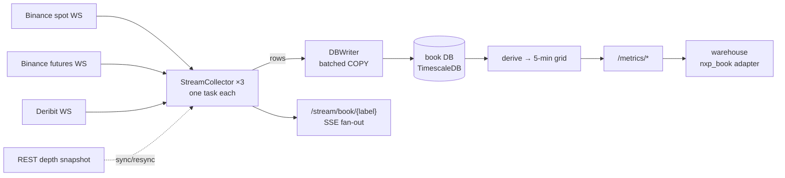

# nxpNodeBook

> **Data node — order books and the trade tape.** Tick-level L2 books and every
> print from the venues where BTC actually trades, captured over WebSocket,
> stored as received, and published to the warehouse as 5-minute
> microstructure columns.

`nxp-book` · port **9130** · grid **5 min** · stream `nxp-book:5m`

---

## 1. Why this node exists

Every other column in the estate is a transform of something that already
happened at 5-minute resolution or coarser. The measured picture
(nxpWarehouse/doc/30, doc/26) is that direction lives at 5 min – 1 h and is
dead by 6 h. Order-book state and order flow are the one data class that is
*native* to that horizon — and the one class nobody archives for free.

**There is no history to backfill.** No venue serves a past book; no free L2
archive exists. Everything this node knows begins the day it started. That is
the whole argument for starting it early, and the reason the capture loop is
built as the job that cannot be late.

## 2. Where the data comes from

| Stream | Venue channel | What | Snapshot |
|---|---|---|---|
| `btc.spot` | Binance spot `btcusdt@depth@100ms` + `@trade` | L2 diffs every 100 ms, every print | REST `/api/v3/depth?limit=5000` |
| `btc.perp` | Binance USDⓈ-M `btcusdt@depth@100ms` + `@trade` | same | REST `/fapi/v1/depth?limit=1000` |
| `btc.dperp` | Deribit `book.BTC-PERPETUAL.100ms` + `trades.BTC-PERPETUAL.100ms` | L2 changes batched at 100 ms, every print | in-band (`type: snapshot`) |

All public, no keys. `BOOK_STREAMS` adds or removes streams; the **label** is
the middle of every derived column name and must never change once data
exists under it.



## 3. The join that must be right

A diff stream tells you what *changed*, not what the book *is*. The venue
protocol is snapshot-then-diffs with sequence numbers on both, and getting
that join wrong produces a book that is plausibly shaped and quietly wrong.
The rules live in `domain/book.py` as pure functions and are tested as such:

| Venue | drop | first applied event | every later event |
|---|---|---|---|
| Binance spot | `u <= lastUpdateId` | `U <= lastUpdateId+1 <= u` | `U == prev u + 1` |
| Binance futures | `u < lastUpdateId` | `U <= lastUpdateId <= u` | `pu == prev u` |
| Deribit | — | the in-band `snapshot` | `prev_change_id == prev change_id` |

Any violation — or a book that **crosses** after applying, which is the same
defect seen from the other side — marks the book untrustworthy, records the
message as `applied = false`, and starts a resync (new REST snapshot, or a
resubscribe on Deribit). Nothing is thrown away: every message is stored either
way, so a replay can see exactly where the stream stopped being reliable.

## 4. What is stored

```
book_events     every depth message, as sent, + top of book AFTER applying   ← capture-or-lose
book_snapshots  full in-memory book at every sync/resync and every 5 min     ← replay anchors
trades          every print, venue unit + USD notional                       ← capture-or-lose
stream_runs     one row per WebSocket session                                ← declared gaps
grid_features   the derived 5-min grid                                       ← recomputable
```

One row per **message**, not per level: `bids`/`asks` are jsonb arrays of
`[price, qty]` strings exactly as quoted. `ts` is the venue's event time;
`received_at` is ours, so transport latency is measurable rather than assumed.
Compression after 2 days, segmented by stream.

**Retention.** `BOOK_EVENTS_RETENTION_DAYS=0` (default) keeps every diff.
Snapshots and trades are always kept. Fill in the measured rates below before
deciding otherwise; a silent disk-fill is the failure this estate has already
had once.

Measured on 2026-09-13 over the first 13 minutes (BTCUSDT / BTC-PERPETUAL,
three streams, uncompressed hypertable size):

| Table | rows / 13 min | size / 13 min | → per day (uncompressed) | → per year, compressed (~8–10×) |
|---|---|---|---|---|
| `book_events` | 18,600 | 20 MB | ~2.2 GB | ~80–100 GB |
| `trades` | 9,900 | 2.6 MB | ~0.3 GB | ~12–15 GB |
| `book_snapshots` | 15 | 0.5 MB | ~55 MB | ~2–3 GB |

Per-stream message rates: Binance spot and futures ≈ 10 depth msgs/s each,
Deribit ≈ 3/s; trades ≈ 6–8/s per Binance stream, < 1/s on Deribit. Re-measure
after the first compressed chunk (day 3) before trusting the yearly column.

## 5. Derived columns

Served as `<asset>.<label>.<feature>`, e.g. `BOOK.btc.spot.spread_bps`,
`MICRO.btc.perp.cvd_usd`. A value at `ts` summarises the bucket
`[ts − 5 min, ts)` — the ceiling rule every node uses; nothing is published
before it could be known.

| Column | What | Unit |
|---|---|---|
| `BOOK.*.spread_bps` | mean quoted spread after every applied message | bp of mid |
| `BOOK.*.mid` | mid after the last applied message | USD |
| `BOOK.*.updates` | depth messages applied | count |
| `BOOK.*.depth_bid_{10,50}bp` / `depth_ask_*` | resting notional within the band at the bucket's snapshot | USD |
| `BOOK.*.imbalance_{10,50}bp` | (bid − ask)/(bid + ask) within the band | ratio |
| `MICRO.*.ofi_usd` | order-flow imbalance (Cont–Kukanov–Stoikov) summed over the bucket | USD |
| `MICRO.*.cvd_usd` | aggressor buys − sells, this bucket's delta | USD |
| `MICRO.*.volume_usd`, `trades`, `trade_p50_usd`, `trade_p90_usd` | the tape | USD / count |

**One unit for depth and flow: USD notional.** Binance quotes BTC, Deribit's
inverse perpetual quotes USD; the derive multiplies by price on Binance and not
on Deribit, so the columns are comparable across venues.

**Every column is absent — never zero — when the stream was down.** Zero
trades is an observation only if the collector was connected. The read side
must pin `fill_mode="none"`; `/capabilities` says so per column.

## 6. Interfaces

```
GET /metrics/catalog                 names, first/last ts, point counts
GET /metrics/{name}?period=5m&start=…&end=…&node=nxp-book:5m
GET /health        contract v1 (nxp-node-contract), + per-stream capture freshness from memory
GET /coverage      per-stream sessions / resyncs / snapshot density, per-metric density vs declaration
GET /capabilities  meaning + fill rule per column; service block from the node's own OpenAPI
GET /book/{label}?levels=10          live in-memory book (operator view)
GET /stream/book/{label}             the same as Server-Sent Events, on every sequence advance
```

`/health.ok` is the AND of: database answers, collectors + scheduler running,
**every stream connected, synced and heard from within 60 s**, every grid
column within 30 min, no failed gate. A reconnect shows as `ok=false` for as
long as it lasts and as a `stream_runs` boundary forever.

## 7. Run

```bash
cp .env.example .env            # set BOOK_DB_PASSWORD
eval "$(ssh-agent -s)" && ssh-add ~/.ssh/id_ed25519   # the contract pin is a private git dep
docker compose build && docker compose up -d
curl -s localhost:9130/health | jq '.ok, .capture_streams[] | {label, connected, synced, event_lag_seconds}'
curl -N localhost:9130/stream/book/btc.spot?levels=5
```

Data lives on the array at `/mnt/warehouse/nxp-book/pgdata`; Postgres is on
host port 5437. The API applies `db/init/*.sql` on every start (idempotent),
so an adopted or restored database always has the schema the code expects.

Tests need no network and no database:

```bash
python -m venv .venv && . .venv/bin/activate
pip install -r api/requirements.txt pytest pytest-asyncio ../nxpNodeContract
cd api && python -m pytest -q
```

## 8. Status

Collecting since **2026-09-13 19:54 UTC** on the warehouse host (compose).
Reaching it from the cluster needs the same `Service`/`Endpoints` pair the
other nodes had before their Phase-4 move (`externalServices.nxp-book-api`,
ip 192.168.2.20, port 9130), then an `nxp_book` warehouse adapter that is a
near-copy of `nxp_options`.
